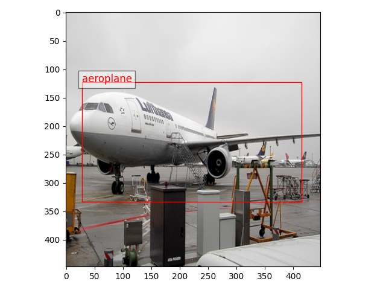
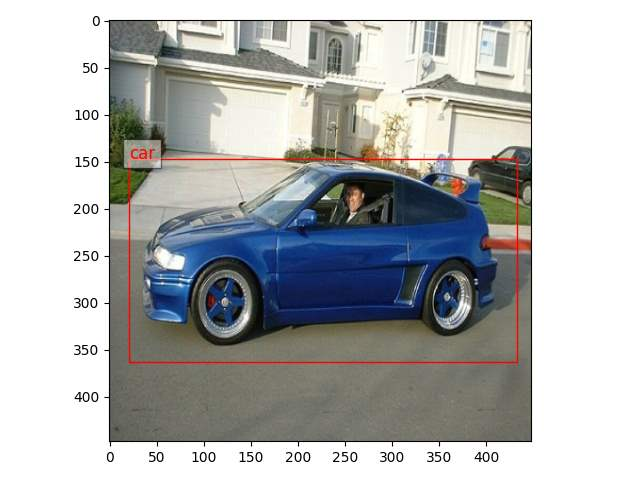
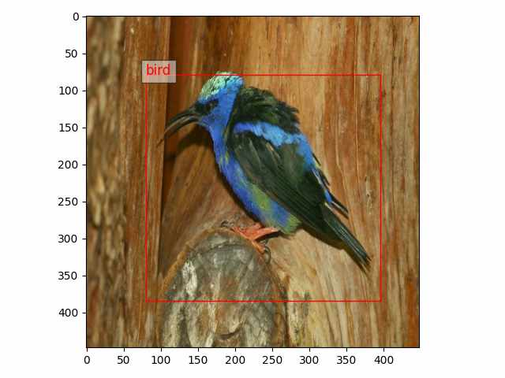
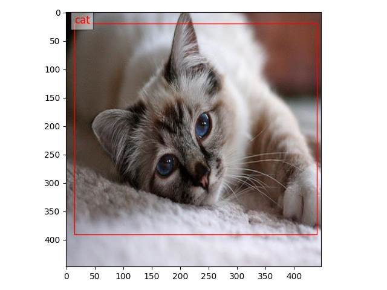
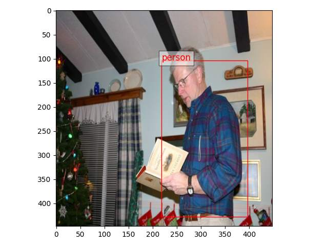
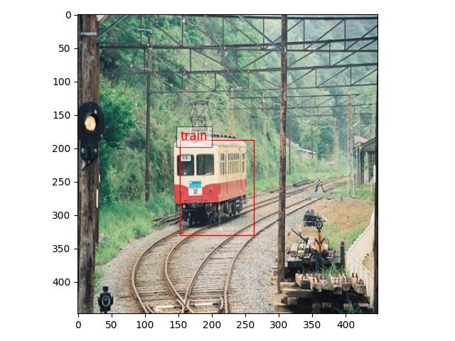
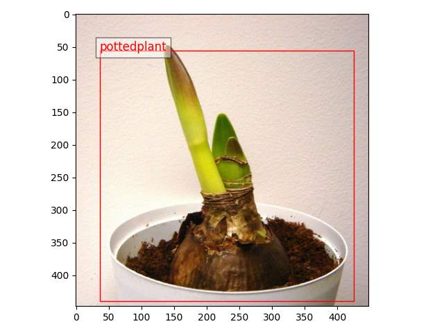
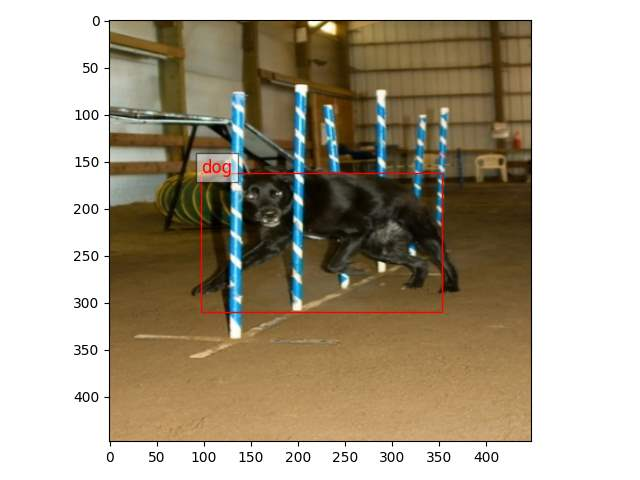

# YOLO
This is my first PyTorch implementation of YOLO from scratch. You can download the VOC dataset [here](https://kaggle.com/datasets/16b88abb1aa8e887d7798e7bd7399a71a7a6d39e99c7d0189ba3f23b6dba132a). 

## Detected images
  

   

